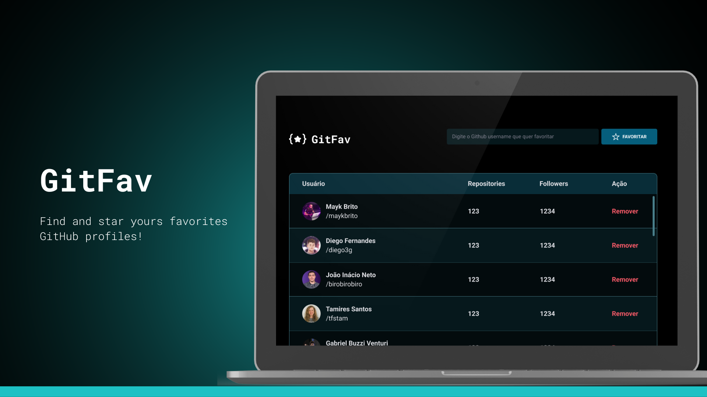

## The Project 
Welcome to Find and Star, your go-to tool for discovering and bookmarking your favorite GitHub profiles! With our intuitive interface and powerful search functionality, you can effortlessly explore a universe of developers and star the ones you admire the most.

Whether you're looking for inspiration, seeking collaborators, or simply want to stay updated on the latest projects, Find and Star has you covered. Say goodbye to endless scrolling and hello to a curated collection of your top picks!

## Development Challenges
One of the significant development challenges I tackled was implementing the CRUD operations (Create, Read, Update, Delete) for managing GitHub user profiles. I needed to ensure that users could seamlessly add new profiles, update existing ones, delete profiles they no longer needed, and save their changes securely.

Saving user profiles securely was another significant challenge. I opted to use the localStorage to persist user data locally. This involved serializing and deserializing profile data to and from JSON format, managing data consistency, and implementing backup and recovery mechanisms to prevent data loss.

## Technologies
The technologies used were:
- HTML;
- CSS;
- Javascript;
- Figma;
- Localstorage.

## Layout
You can see the project's layout at [link](https://www.figma.com/file/tCW3QbC89rmsMSrtxxo0cr/%5BDesafios-Explorer%5D-GitFav-(Copy)-(Copy)?type=design&node-id=301-324&mode=design&t=J36TF6osGfHlYpl0-0). 
A [Figma](https://www.figma.com) account is required.